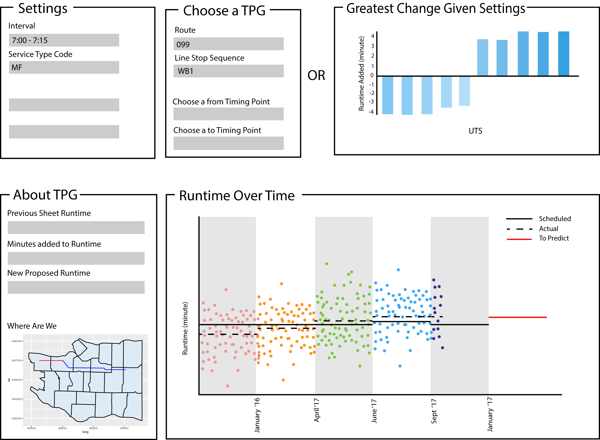

### What is this about

Going through designing a dashboard for a client has given me some insight into how to go about designing a dashboard efficiently and saving much time and and effort. As part of the UBC Master of Data Science program we worked with industry partners for 8 weeks to create solutions. In this blog post I want to go over our dashboard design process, how it saved us time, and how much your initial pie-in-the-sky thoughts will change. If you have any other advice you've found useful let me know in the comments!

### Tooling

I designed our dashboard using [R's Shiny package](https://www.rstudio.com/products/shiny/) which gives you the ability to customize a lot of your work. It's also flexible enough for you to put in your own javascript to make changes not available in the default offerings.

### 1. What does your client really need?

When you first sit down with your client you will discuss what you will be developing. I've found that whatever you have in mind is going to be quite a bit different than what you have in your mind at the time. Both your client's ideas and your ideas will be amazing and really cool but not all pan out. I've found this designing/creating a variety of things from graphics, websites, scripts, research posters, a thesis, and dahsboards. I've also found this when asking someone else to create things for me as well. While being super creative we can ignore the realities that make something difficult to do or useful to have. Personally I think that is good - it allows us to think up ideas that being negative would not allow us. But in return we also need some time to hash out those realities. Tip 1: Know why as well as what.

In addition to what your clients want, ask what they want it for. I am never sure what roads my designs will take me but at least I will know my destination. Knowing what they want to accomplish with your product helps guide everything you develop so you don't get lost in the random forest. Get lots of feedback and do it regularly.

### 2. Make a mockup

Creating a mockup is one of the best decisions we made. Rather than thinking of what we wanted the product to do, we also thought about how it would do those tasks for the user. I was honestly surprised how many questions I had after trying to describe the product visually. I scraped many functions we envisioned after seeing how they would present to the user. This saved a lot of work I would have spent coding in functionality that would end up useless. So tip 2: layout your product and see if you are going to include a feature.

Because of my experience with Adobe Illustrator I took everyone's ideas and sketched them out on an artboard roughly the size of a typical screen. Your first mockup doesn't need to be as detailed as mine but I love visualizations and details. Funny enough, our peers thought our dashboards were already built when we presented our initial MVPs to the program.

Just the first iteration brought up many questions like how will things be arranged on the page, how much space do we need for a feature, what options to include and where. Below is what the design we first presented to our clients and peers. 

Another benefit of mockups for dashboards was applying visualization theory that we learned from the super interesting [Tamara Munzner](http://www.cs.ubc.ca/~tmm/) and [the Non Designer's Design Book](https://www.amazon.com/Non-Designers-Design-Book-4th/dp/0133966151). Considerations about what we could include without confusing the user helped us refine our work and save time building and cutting. If you're interested in the technical aspects like visual encoding methods, check out her book or other publications.

### 3. User Test and test again

Your product should be able to stand alone without you having to walk someone through it. You won't be there after you've gone and you want your clients to understand what they're doing. So when you show your product to your clients you should also be silent. If they can't figure it out then you need to add instructions or make the product clearer. The experience of hearing a user think outload while they use your product and you can't speak is excruciating. Having spent all your time creating this and knowing your intention for everything makes you go crazy when a fresh user sits trying to puzzle out your confusing interface. You scream internally about how it's obvious that's how it works but then you realize... no... It's not obvious, I've just done it so many times I've forgotten. And that lays out the usefulness of tip 3: User test frequently and like a ninja. Silence is golden.

### 4. Show rather than tell

Sometimes you have different ideas on how to design components with your team or partners. 